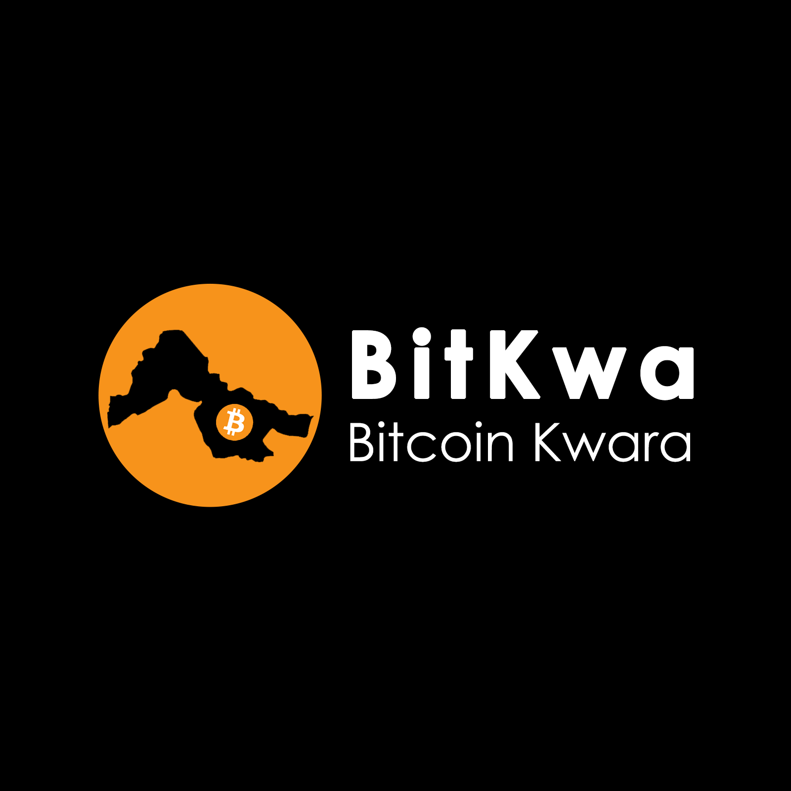

<p align="center">
  
</p>

# BitKwa Bitcoin Diploma

**BitKwa Bitcoin Diploma** is an 8-week practical program designed to educate and empower Africans on Bitcoin, focusing on solving local financial challenges first, then scaling globally. The program combines theory, practical exercises, projects, and mentorship to ensure participants understand and can apply Bitcoin in real-world contexts.

## Features
- Practical, hands-on Bitcoin education
- Tailored for African demographics (15–55 years old)
- Covers Bitcoin technology, economics, privacy, and African use-cases
- Final project to showcase applied knowledge
- Access to community, mentorship, and resources

## Structure
The program is divided into 8 modules:
Chapter 1: Money (The History, What is, & Why Do We Need it?)
Chapter 2: Fiat Money, Its Problems, and the Search for Solutions
Chapter 3: Bitcoin: Introduction & How to Use It
Chapter 4: The Lightning Network
Chapter 5: An Introduction to the Technical Side of Bitcoin
Chapter 6: Bitcoin for Activism: Privacy & Human Rights
Chapter 7: Careers & Building in Bitcoin (Africa Focus)
Student Final Project Presentations
Graduation


**BitKwa Bitcoin Diploma  Comprehensive Overview**

The BitKwa Bitcoin Diploma is a practical and accessible educational program designed to empower individuals across Africa with a deep understanding of Bitcoin, its economic potential, and practical use cases. Developed by BitKwa, a leading Bitcoin education and empowerment organization, this program is tailored to the unique economic, social, and technological realities of African communities. It bridges the knowledge gap, promotes financial inclusion, and enables participants to actively participate in the growing Bitcoin ecosystem.

**Program Objectives:**
-Provide Africans with reliable, practical, and actionable Bitcoin knowledge.
-Equip participants with the skills to use Bitcoin safely and effectively in everyday life.
-Foster community-level adoption and participation in peer-to-peer (P2P) Bitcoin networks.
-Support economic empowerment by enabling users to protect wealth, transact seamlessly, and participate in circular economic activities.


**Target Audience:**
Designed for Africans aged 15–55, including students, entrepreneurs, tech enthusiasts, and community leaders. The program addresses Africa’s demographic realities, where financial inclusion is limited, mobile technology adoption is high, and peer-to-peer solutions are essential for economic participation.

Curriculum Structure & Delivery:
Duration: 8 weeks
Format: Hybrid, combining online learning modules with live virtual sessions for real-time interaction and mentorship.


**Learning Outcomes:**
Participants will gain:
-Practical skills to transact, store, and manage Bitcoin securely.
-Knowledge to educate and guide peers and communities.
-Understanding of Bitcoin’s economic impact in Africa and globally.
-Capacity to integrate Bitcoin into personal and business financial strategies.


**Graduation Criteria:**
To successfully graduate and receive the BitKwa Bitcoin Diploma, participants must:
-Achieve 100% attendance across all 8 weeks.
-Score at least 70% on all assessments/tests.


**Certification Details:**
Graduates receive the BitKwa Bitcoin Diploma, a recognized credential signaling competence in Bitcoin usage and adoption. The diploma holds value both within African communities and globally, positioning holders as knowledgeable and trusted Bitcoin practitioners.
 
**Community Impact:**
The program addresses local challenges such as limited access to traditional financial systems, inflation risks, and restricted cross-border payment solutions. By empowering participants with Bitcoin knowledge and practical skills, the program fosters economic inclusion, resilience, and community-driven innovation.

**Unique Features:**
Africa-focused curriculum addressing local challenges first.
Hands-on, practical training rather than purely theoretical instruction.
Age-inclusive approach for both youth and working adults.
A combination of online flexibility and interactive mentorship for real-world application.


In essence, the BitKwa Bitcoin Diploma is not just an educational program, it is a tool for financial empowerment, community development, and African-led innovation in the Bitcoin ecosystem.


## Getting Started
Clone this repository:
```bash
git clone https://github.com/BitKwa/bitkwa-bitcoin-diploma.git
